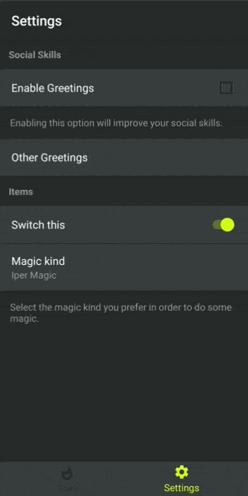

  

<a href="https://t.me/joinchat/EibedxVyHBjVSgZtYhTFUw"></a>

# ShouldSet

ShouldSet is an Android library written in Kotlin used to build and menage preferences screens.

Inspired by [Telegram X android app](https://play.google.com/store/apps/details?id=org.thunderdog.challegram) material style, specifically by the settings one, it provides 
a declarative way to add ready-to-use preference items in your views and manage the preference values everywhere in your code. 

ShouldSet lay upon the android SharedPreferences, by this making it fully compatible with them.

## Getting started

### Installing
If you haven't yet add the jitpack repository in your project gradle:
```groovy
allprojects {
    repositories {
        maven { url: 'https://jitpack.io' }
    }
}
```

Add the ShouldSet dependency in your app gradle and sync the project:
```groovy
dependencies {
      implementation 'com.github.MontiniCristian:ShouldSet:v0.1.0'
}
```

### Configuring
In order to use this library you need to initialize the [ShouldManager] into the Application class: 

```kotlin
class Application: Application() {

    override fun onCreate() {
        super.onCreate()
        ShouldManager.init(this)
    }
}
```

or in your first usable Activity:

```kotlin
class MainActivity : AppCompatActivity() {

    override fun onCreate(savedInstanceState: Bundle?) {
        super.onCreate(savedInstanceState)
        ShouldManager.init(this)
    }
}
```

### Basic usage
Start using this library is as easy as adding a view to your xml, so let's do this:

Add a ShouldSetScreen in your fragment or [Conductor controller](https://github.com/bluelinelabs/Conductor) layout:
```xml
<com.cristian.shouldset.view.ShouldSetScreen
   android:id="@+id/shouldSetScreen"
   android:layout_width="match_parent"
   android:layout_height="match_parent">
</com.cristian.shouldset.view.ShouldSetScreen>
```

Here's an example from my SettingsFragment:
```xml
<?xml version="1.0" encoding="utf-8"?>
<LinearLayout xmlns:android="http://schemas.android.com/apk/res/android"
    xmlns:app="http://schemas.android.com/apk/res-auto"
    android:orientation="vertical"
    android:layout_width="match_parent"
    android:layout_height="match_parent">

    <androidx.appcompat.widget.Toolbar
        android:layout_width="match_parent"
        android:layout_height="wrap_content"
        app:title="@string/settings_toolbar_title"/>
    
    <com.cristian.shouldset.view.ShouldSetScreen
        android:id="@+id/myShouldSetScreen"
        android:layout_width="match_parent"
        android:layout_height="match_parent">
    </com.cristian.shouldset.view.ShouldSetScreen>
    
</LinearLayout>
```
Once you have done with it you can access myShouldSetScreen from your fragment's onViewCreated method and start populating the screen:

```kotlin
override fun onViewCreated(view: View, savedInstanceState: Bundle?) {
        super.onViewCreated(view, savedInstanceState)
        
        myShouldSetScreen.build {

            categoryTitle {
                title = "Social Skills"
                textColor = R.color.colorSecondary
                backgroundColor = R.color.colorPrimaryDark
            }

           checkBoxPreference("areGreetingsHappening") {
                backgroundColor = R.color.colorPrimary
                textColor = android.R.color.white
                setOnValueChangeListener {
                    if (it) print("Say hello")
                    if (!it) print("I'll be quiet")
                }
                title = "Enable Greetings"
            }

            descriptor {
                backgroundColor = R.color.colorPrimaryDark
                description = "Enabling this option will improve your social skills."
                textColor = R.color.colorSecondary
            }
        }
}
```


And then with a little bit of fantasy you can go on and customize your preference screens:
```kotlin
myShouldSetScreen.build {

            categoryTitle {
                title = "Social Skills"
                textColor = R.color.colorSecondary
                backgroundColor = R.color.colorPrimaryDark
            }

           checkBoxPreference("areGreetingsHappening") {
                backgroundColor = R.color.colorPrimary
                textColor = android.R.color.white
                setOnValueChangeListener {
                    if (it) print("Say hello")
                    if (!it) print("I'll be quiet")
                }
                title = "Enable Greetings"
            }

            descriptor {
                backgroundColor = R.color.colorPrimaryDark
                description = "Enabling this option will improve your social skills."
                textColor = R.color.colorSecondary
            }

            bottomRadioGroupPreference {
                keyLabelPair = hashMapOf(
                    "isSomething" to "Something",
                    "isMagic" to "Magic",
                    "areGreetingsHappening" to "Alternative Greet"
                )
                backgroundColor = R.color.colorPrimary
                textColor = android.R.color.white
                title = "Other Greetings"
                dividerColor = R.color.colorPrimaryDark
            }

            dividerLine {
                color = R.color.colorPrimaryDark
            }

            categoryTitle {
                title = "Items"
                textColor = R.color.colorSecondary
            }

            switchPreference("isSwitched") {
                backgroundColor = R.color.colorPrimary
                textColor = android.R.color.white
                title = "Switch this"
            }

            dividerLine {
                color = R.color.colorPrimaryDark
            }

            bottomCheckBoxGroupPreference("magic_kind", "duperMagic") {
                backgroundColor = R.color.colorPrimary
                textColor = android.R.color.white
                title = "Magic kind"
                dividerColor = R.color.colorPrimaryDark
                textValueColor = R.color.colorSecondary
                valueLabelPair = hashMapOf(
                    "superMagic" to "Super Magic",
                    "duperMagic" to "Duper Magic",
                    "anotherMagic" to "Another Magic",
                    "strangeMagic" to "Strange Magic",
                    "iperMagic" to "Iper Magic"
                )
            }

            descriptor {
                backgroundColor = R.color.colorPrimaryDark
                description = "Select the magic kind you prefer in order to do some magic."
                textColor = R.color.colorSecondary
            }
        }
```



### Getting the preferences
You can read them once unig the default PreferenceManager:
``` kotlin
val bool = PreferenceManager.getDefaultSharedPreferences(context).getBoolean("areGreetingsHappening", true)
```

Or you can read as BehaviorSubject to automagically update instantly your preference result:
``` kotlin
ShouldManager.getBooleanAsBehaviorSubject("areGreetingsHappening", true).subscribe { 
        print("Updated value $it")
}
```

## Contributing
Please read [CONTRIBUTING.md](./CONTRIBUTING.md)


